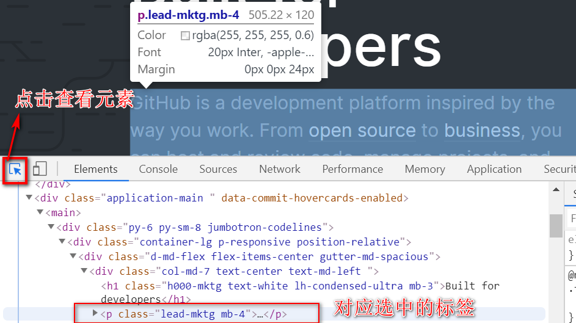
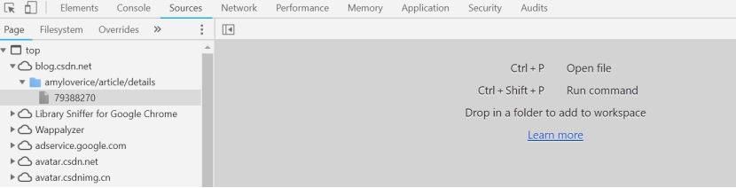
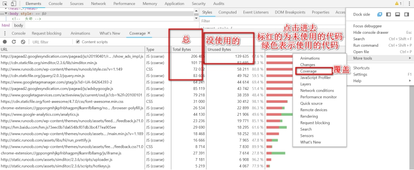
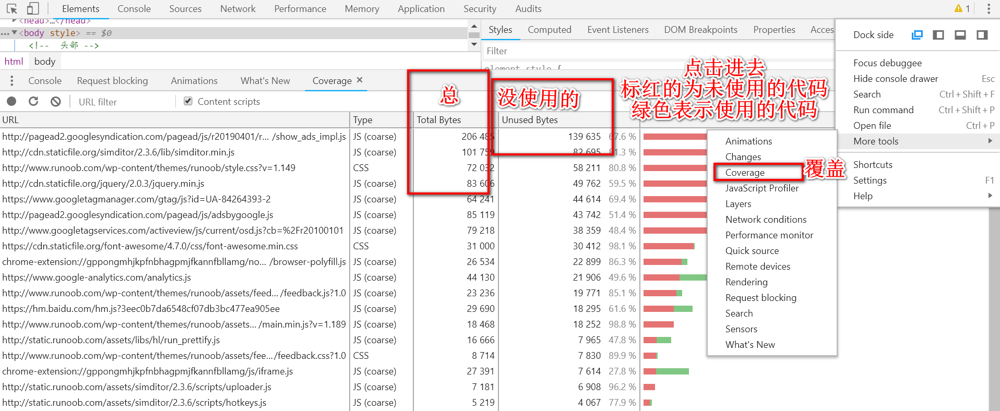
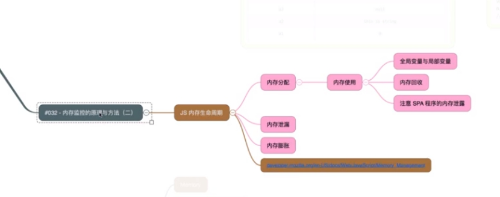
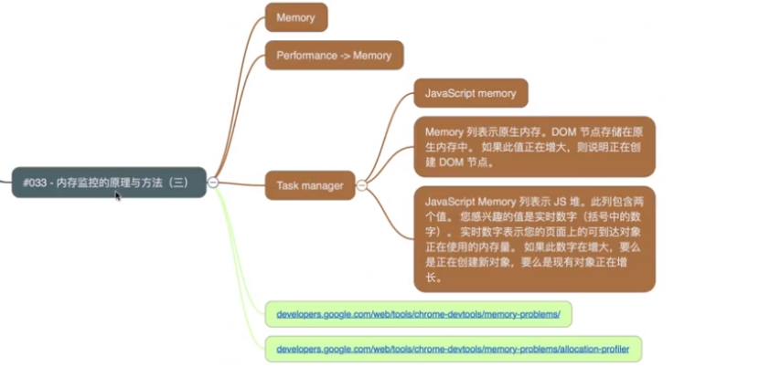

[chrome DevTools使用及详解](https://developers.google.com/web/tools/chrome-devtools/)

### 打开Chrome开发者工具

- 在Chrome菜单中选择更多工具>开发者工具
- 在页面元素上右键点击，选择检查
- 使用快捷键Ctrl+Shift+I(Windows)或Cmd+Opt+I(Mac)
- 打开最近使用的面板Cmd+Option+I(Mac)或Ctr+Shift+I(Windows)

### Elements元素面板

DOM树的相关信息，检查编辑DOM页面显示内容及样式。

- 检查元素，点击右上角的检查按钮（箭头符号）

快捷键Cmd+Opt+C(Mac)或Ctrl+Shift+C(Windows,Linux,Chrome OS)

- left or right找到层级对应的父（子）集，打开关闭元素对应的层级
- up or down往上（下）移动
- 迅速将页面滚动到选中元素，点击右键，选择Scroll into view，如果页面中没有对应的内容则无作用

- 查找对应内容的节点，快捷键Ctrl+F or Cmd+F

- 编辑标签内的内容，双击标签中间内容

- 编辑标签对应的属性，双击开始标签

- 重构DOM节点，鼠标拖拽移动对应的标签到对应位置

- 强制改变状态，点击:hov，选中想要的状态

- 隐藏节点，选中节点按H键，显示隐藏对应的标签

- 删除节点，选中节点，按Delete键，或者点击右键选择Delete Element,然后按Ctrl+Z 或Cmd+Z,返回删除前的状态

- 控制台选中节点

  按Escape键调出Console控制台，选中对应的节点，输入$0,鼠标移到对应的输出结果上，页面选中对应的节点

- 将对应的节点存储为全局变量

  选中节点点击右键，选中Store as global variable，在控制台输出temp1……

- 复制JS路径，选中节点，点击右键选择Copy > Copy JS path,在控制台粘贴回车

- DOM节点改变打断点，选中节点，右键Break On > Attribute Modifications.点击DOM Breakpoints，点击回车跳转到改变样式的js文件

- 对应移除DOM节点，节点修改

- 按HTML格式进行修改

打开more actions菜单并选择Edit as HTML

- 按F2(Windows/Linux)或Fn+F2(Mac)
- 按Esc可以退出编辑而不保存
- 查看元素事件侦听器Event Listeners
- 如果启用Ancertors复选框，除了当前选定节点的事件监听器外，还会显示其祖先实体的事件侦听器
- 启用Framework listeners复选框时，DevTools会自动分析事件代码的框架或内容库封装部分，然后告诉你实际复选框，事件侦听器代码可能会在框架或内容库代码的地方解析

### DevTools修改CSS

点击空白处新增样式属性及值

点击.cls旁边的加号增加选择器样式

### Console控制台面板

- 勾选Preserve log，保留页面加载前的日志输出

在开发过程中使用console.log()等记录诊断信息，可与文档和工具交互的 shell 提示符 [$()](https://developer.chrome.com/devtools/docs/commandline-api#selector) 

- 快捷键Cmd+option+J(Mac)或Ctrl+Shift+J(Windows,Linux,Chrome OS)；
- 以抽屉式导航栏打开，按ESC(点击Console时隐藏)；
- 点击选择Show Console；
- 消息堆叠，左侧显示一个数字，表明重复次数；
- 不堆叠时选择show timestanps（settings）；
- 保留页面加载前的日志输出，勾选Preserve log；
- 处理控制台历史记录；
- 清除，点击右键clear console，控制台输入clear()；
- 按Ctrl+L；
- Ctrl+Shift+P运行代码

### Sources源代码面板

#### 快速以编辑状态查看一个站点加载的所有资源

快速搜索文件：

Ctrl + P 查看文件（字段搜索）

打开文件后：

 Ctrl + F根据字段搜索对应文件里面的字段

按住Ctrl点击鼠标进行多处编辑

Ctrl + D 选择多个相同字段

Ctrl + G 跳转到对应的行数

#### JavaScript断点调试

### Network网络面板

提供了有关已经下载和加载过的资源的详细分析。在优化页面的基本过程中，确定和找到那些请求通常要比预计的时间更长。

### Performance性能面板

### Memory内存面板

### Application应用面板

### Audits审计面板

### Security安全面板

### Coverage网页性能优化，查看网页代码的使用率

### Rendering查看页面重绘的标签

- More tools > .Rendering > 

### Animations监控页面动画的变更

- More tools > .Animations> 

### Network Conditions网络条件与User Agent设置

More tools > .Network Conditions> 

### 常用快捷键

- 审查元素Cmd+Opt+C(Mac)或Ctrl+Shift+C(Windows,Linux,Chrome OS)
- 打开控制台面板Cmd+option+J(Mac)或Ctrl+Shift+J(Windows,Linux,Chrome OS)
- 刷新页面F5,Ctrl+R或Cmd+R
- 刷新页面并忽略保存Ctrl+F5,Ctrl+Shift+R/Cmd+Shift+R
- 放大DevTools   Ctrl+'+'/Cmd+Shift+'+'
- 缩小DevTools  Ctrl+'-'/Cmd+Shift+'-'
- DecTools恢复大小 Ctrl+0/Cmd+0
- 面板之间的切换`Ctrl` + `[` 和 `Ctrl` + `]`

- Ctrl + Shift + F 搜索文件里面所有字段
- Ctrl + P 查看文件（字段搜索）

强制改变元素状态Force element state

Shift + click,颜色的切换

## Remote Devices

### 调试Android设备的方法

## Search

### 查找所有文件的字段

More tools > Search

Ctrl + Shift + F 搜索文件里面所有字段

## Request blocking

### 浏览器阻止一些资源

More tools > Request blocking 设置自己想要的正则表达式

## Sensors

### 如何在浏览器中模拟传感器的数据

More tools > Sensors

## Performance

### 性能分析

FPS帧

Network

快捷键WASD

Call tree 跳转到源码

## 内存监控的原理和方法

值类型与引用类型的区别

栈和堆

 

## 什么是 manifest

## Service workers

## 快速清空所有的本地存储资源

 

## Indexeddb

<https://caniuse.com/>

<http://www.tfan.org/using-indexeddb/>

## Web SQL

关系型数据库，已经被废弃

## 快速转存站点资源

## Security节点功能讲解

Ssl-checker.online-domain-tools.com

全站https

## audit的使用详解

Lighthouse

yslow

### 文档

<https://github.com/CompileYouth/front-end-study/blob/master/tool/devtools/Elements.md>

 

 

 

 

 

 